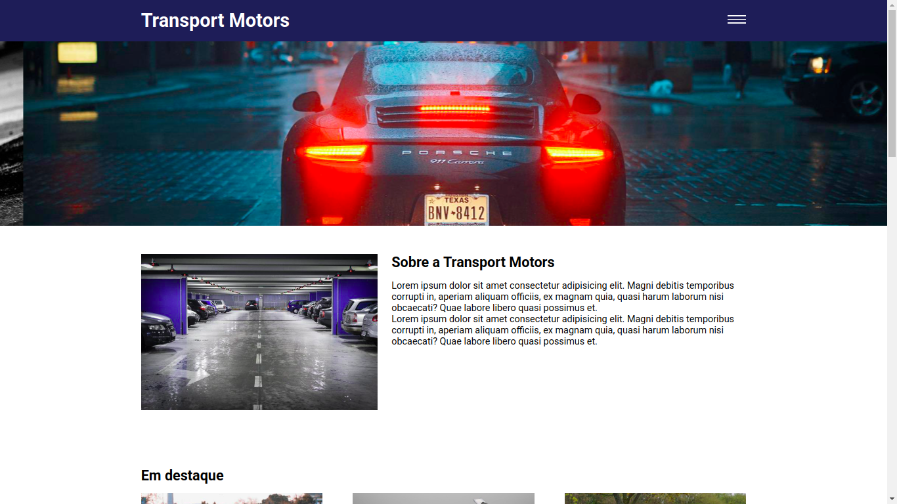
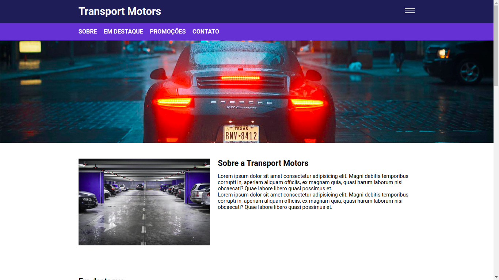
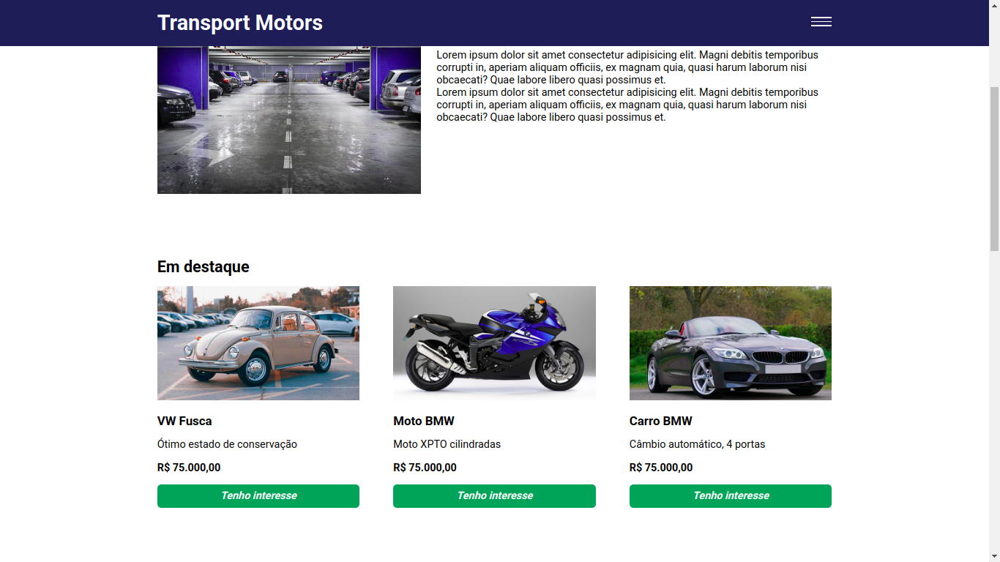
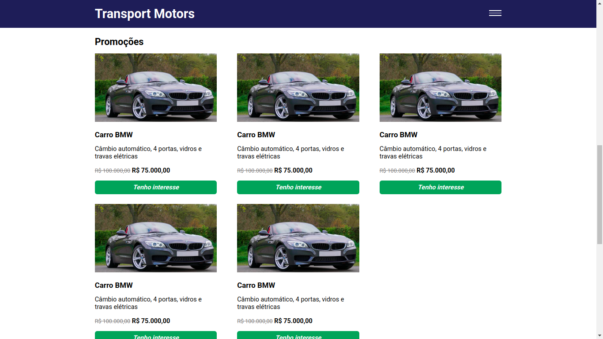
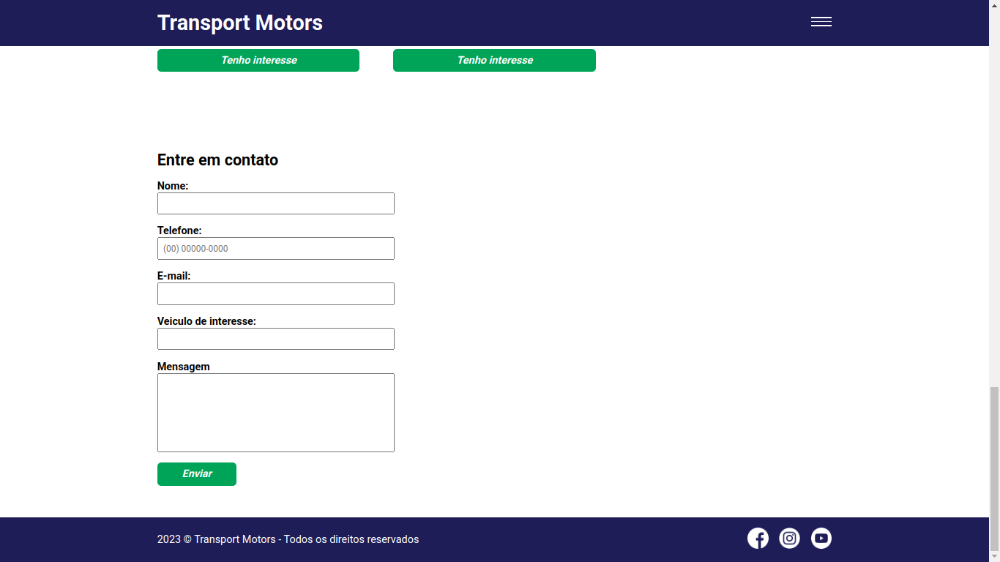

# Transport Motors

Landing page criado com <b>HTML</b>, <b>CSS</b> e <b>jQuery</b>.  
Link: https://transport-motors-jquery.vercel.app/

# Modo Desktop

## Menu hamburguer e um carrossel de imagens

- Criado <b>Menu</b> e um <b>Carrossel de imagens</b> com <b>jQuery</b> utilizando os seus plugins.  
- Para visualizar, [clique aqui](https://transport-motors-jquery.vercel.app/).

## Seção Em Destaque e Promoção

- Ao clicar em <b>Tenho interesse</b>, a pagina rola até o formulário, e o nome do veiculo de interesse é exibido no mesmo.

**_Seção: Em destaque._ **

**_Seção: Promoções._ **

## Seção: Entre em contato.

- Formulário criado com <b>jQuery</b> utilizando os seus plugins.

